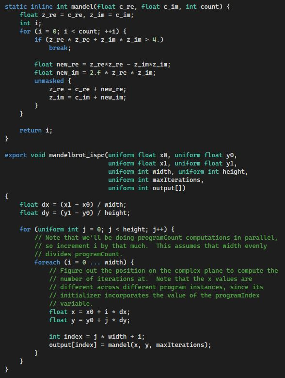

# README #

Author: [planet620]

The following project presents a syntax colorizer for Intel® Implicit SPMD Program Compiler ([ISPC]) language.
distributed as VSIX package for Visual Studio 2022.

Based on [ISPC Language] specification page.

Example view:

### Prerequisites ###

* Requires .NET 4.7.2
* [Visual Studio SDK]
* [Visual Studio SDK Build Tools]
* Both packages can be added from NuGet directory.

https://docs.microsoft.com/en-us/visualstudio/extensibility/creating-an-extension-with-an-editor-item-template?view=vs-2022

[//]: # (links)

   [planet620]: <https://mpolaczyk.pl>
   [Visual Studio SDK]: <https://www.nuget.org/packages/Microsoft.VisualStudio.Sdk>
   [Visual Studio SDK Build Tools]: <https://www.nuget.org/packages/Microsoft.VSSDK.BuildTools>
   [ISPC]: <https://ispc.github.io/index.html>
   [ISPC Language]: <https://ispc.github.io/ispc.html#the-ispc-language>