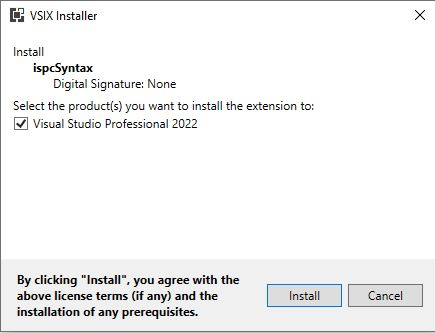
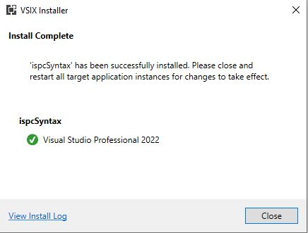

## ispcSyntax ##

Author: [planet620]

The following project presents a syntax colorizer for Intel® Implicit SPMD Program Compiler ([ISPC]) language.

* Developed using Managed Extensibility Framework (MEF)

* Distributed as VSIX package for Visual Studio 2022

* Based on [ISPC Language] specification page

Example colorized view, based on mandelbrot example from [ISPC Release]:

## Installation ##

Extension can be installed without building the solution.

* Double click on ispcSyntax.vsix

* Follow the installation steps

Step 1:

Step 2:

## Build ##

The solution can be extended and developed further. The following prerequisites are required:

* .NET 4.7.2

* [Visual Studio SDK]

* [Visual Studio SDK Build Tools]

* Both packages can be added from NuGet directory.

Additional read: [Editor and language service extensions]

[//]: # (links)

   [planet620]: <https://mpolaczyk.pl>
   [Visual Studio SDK]: <https://www.nuget.org/packages/Microsoft.VisualStudio.Sdk>
   [Visual Studio SDK Build Tools]: <https://www.nuget.org/packages/Microsoft.VSSDK.BuildTools>
   [ISPC]: <https://ispc.github.io/index.html>
   [ISPC Language]: <https://ispc.github.io/ispc.html#the-ispc-language>
   [ISPC Release]: <https://github.com/ispc/ispc/releases/download/v1.19.0/ispc-v1.19.0-windows.zip>
   [Editor and language service extensions]: <https://learn.microsoft.com/en-us/visualstudio/extensibility/editor-and-language-service-extensions?view=vs-2022>